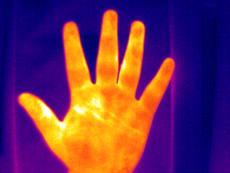

## Infrared Thermal Imaging on Human

### Introduction

This project hosts our ongoing work about applying infrared thermal imaging technology on human body parts.

### Goals

1. Provide sample data of infrared thermal images for human body

2. Develop deep learning-based applications on thermal image analysis

### Credits

Author: Donghua Chen

Please cite this project when using our data and codes here. 